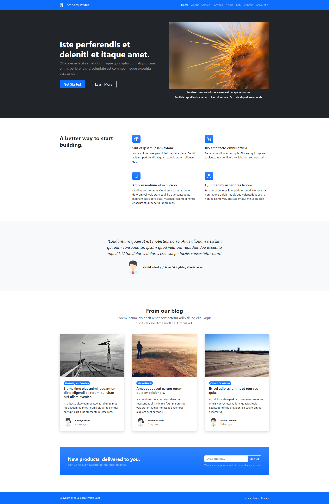

# Company Profile Website

<p>
   This profile website serves as a communication medium between a company and external parties such as clients, readers, or other users. 
</p>
<p>
	This website is a specialized digital platform that serves the purpose of introducing a company to its visitors or readers. 
</p>
<p>
	This kind of directory aims to provide specific information about the company's brand, such as its vision, mission, values, products or services, and even historical background.
</p> 

# Preview




# Features

<ol type="1">
	<li>
		Authentication
		<ol type="1">
			<li>Login</li>
			<li>Register</li>
			<li>Forgot Password</li>
			<li>Reset Password</li>
		</ol>
	</li>
	<li>
		Account Management
		<ol type="1">
			<li>Change Password</li>
			<li>Manage Profile</li>
		</ol>
	</li>
	<li>
		General Page
		<ol type="1">
			<li>Home</li>
			<li>About</li>
			<li>Service</li>
			<li>Portfolio</li>
			<li>Article</li>
			<li>FAQ</li>
			<li>Contact</li>
		</ol>
	</li>
</ol>

# Technologies Used

<ol type="1">
	<li>Visual Studio Code</li>
	<li>Modern Web Browser</li>
	<li>Git 2.4</li>
	<li>
		Backend Technologies
		<ol type="1">
			<li>MySQL 5.7 / Maria DB 11.3</li>
			<li>Python 3.8.10</li>
			<li>pip 20.0.2</li>
			<li>Django 4.2.1 for REST API </li>
		</ol>
	</li>
	<li>
		Frontend Technologies
		<ol type="1">
			<li>CSS3</li>
			<li>HTML5</li>
			<li>Bootstrap 5</li>
			<li>Node JS 20</li>
			<li>React JS 18</li>
		</ol>
	</li>
</ol>

## Getting Started
#### 1. Clone the repository and navigate to the directory
```shell
git clone https://github.com/sandyclockup/company-profile-django.git
cd company-profile-django
```

#### 2. Install backend dependencies, please move to directory company-profile-django/backend
```shell
pip install -r requirements.txt or pip3 install -r requirements.txt
```

#### 3. Make a .env file and customize its settings 
```shell
DJANGO_SECRET_KEY=secret
DJANGO_DATABASE_HOST={app-database-host}
DJANGO_DATABASE_NAME={app-database-name}
DJANGO_DATABASE_USERNAME={app-database-username}
DJANGO_DATABASE_PASSWORD={app-database-password}
DJANGO_DATABASE_PORT={app-database-port}
DJANGO_TIME_ZONE=UTC
DJANGO_UPLOAD_PATH={directory-upload}
```

#### 4. Start MySQL / Maria DB Service , Seed data and Running REST API
```shell
sudo service mysqld start / sudo systemctl start mariadb
CREATE DATABASE {database-name}
python manage.py migrate or python3 manage.py migrate
python manage.py migrate or python3 manage.py seed_data
python manage.py runserver 8000 or python3 manage.py runserver 8000
```

#### 5. Install frontend dependencies, please move to directory company-profile-django/frontend
```shell
npm install
```

#### 6. Make a .env file and customize its settings 
```shell
REACT_APP_TITLE="Hello World"
REACT_APP_BACKEND_URL=http://localhost:8000
```

#### 7. Run Application 
```shell
cd frontend
npm start
```

#### 8. Access application by entering [https://localhost:3000](https://localhost:3000) in the browser.

<br/>

</br>


#### 9. Developer Contact
<ul>
	<li>
		<strong>Linked In</strong> <a target="_blank" href="https://www.linkedin.com/in/sand404/">https://www.linkedin.com/in/sand404/</a>
	</li>
	<li>
		<strong>Facebook</strong> <a target="_blank" href="https://www.facebook.com/sandyandryantz">https://www.facebook.com/sandyandryantz</a>
	</li>
	<li>
		<strong>Instagram</strong> <a target="_blank" href="https://www.instagram.com/sandyandryanto/">https://www.instagram.com/sandyandryanto/</a>
	</li>
	<li>
		<strong>Telegram</strong> <a target="_blank" href="https://t.me/sand404">https://t.me/sand404</a>
	</li>
	<li>
		<strong>Gmail</strong> <a  href="mailto:sandy.andryanto.dev@gmail.com">sandy.andryanto.dev@gmail.com</a>
	</li>
</ul>